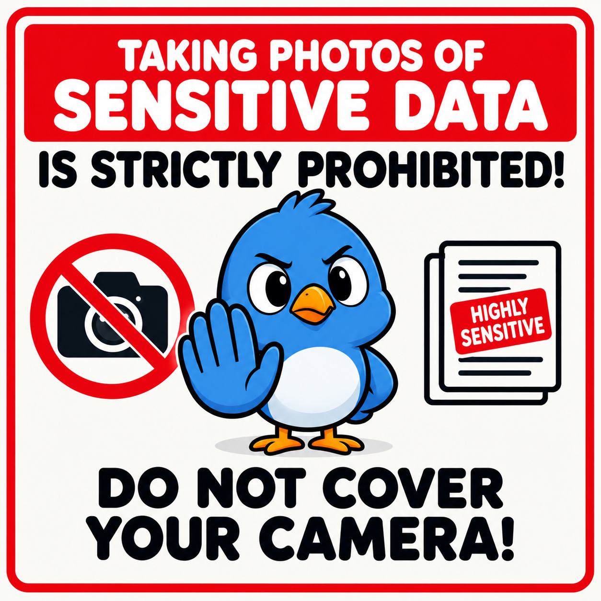
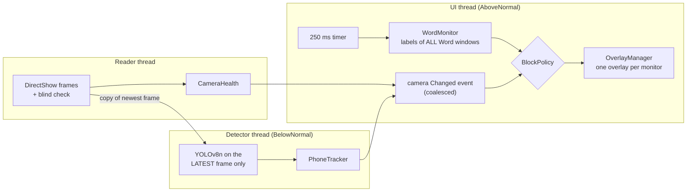

# microsoft-purview-screen-guard



A proof of concept that **covers all your screens** when a Microsoft Word document labeled *Highly Sensitive* is visible **and** either

- a **phone is seen by the webcam** (so nobody photographs the screen), or
- the **camera is not healthy** (covered lens, unplugged, in use, etc.

It is **fail-closed**: when the guard is unsure, it blocks.

> **Independent proof of concept. Not affiliated with, endorsed by, or supported by Microsoft.**
> Microsoft, Word and Purview are trademarks of Microsoft Corporation. MIT license.
> This is a demo of what is possible, **not** a production security product. Read [Limitations](#limitations) first.

## How it works



**Blocking rule**

```
sensitive visible = any Word window that is visible, not minimized, and whose label GUID is in blocked-labels.txt
phone seen        = manual P override  OR  detector says phone
block             = sensitive visible  AND  (phone seen  OR  camera NOT healthy)
```

| Part | What it does |
|---|---|
| **Label check** | Reads `doc.SensitivityLabel.GetLabel().LabelId` from Word over COM, for **every** Word window (not only the foreground one), every 250 ms. Matches on the label **GUID** (the label name can be empty). Sublabels have their own GUID. If Word cannot be read (busy, dialog open) the previous state is kept. |
| **Camera health** | A reader thread opens camera 0 (DirectShow) and computes the grayscale standard deviation of every frame. `std < 12` is *blind* (mean brightness is useless because of auto-exposure). The camera is healthy only after 15 consecutive good frames (warm-up), a frame less than 2 s old, and not blind for longer than 300 ms. If it cannot be opened it is retried every second. |
| **Phone detection** | A second thread runs YOLOv8n (ONNX Runtime, CPU) on the latest frame only and never slows the reader. COCO class 67 (*cell phone*). A phone is *confirmed* by one frame at or above 0.60, or 2 of the last 3 frames at or above 0.40, and stays *seen* for 3 s after the last confirmation. Boxes under 1% of the frame are ignored. |
| **Detector health** | The camera also counts as unhealthy if the model file is missing, the model output is not `[1, 84, N]`, the detector throws, or it has not finished a frame for 3 s. |
| **Overlay** | One borderless topmost window per monitor, created up front and rendered **once** (white background, `blocked.png` centered at up to 60% of the screen). Shown with `SetWindowPos(HWND_TOPMOST, SWP_NOACTIVATE)` and `WS_EX_NOACTIVATE`, so it never takes focus. Topmost is re-asserted every tick while blocked. If the picture is missing or corrupt it falls back to plain white with the single line *Sensitive content hidden*. Blocking never depends on the picture. |
| **Privacy of the overlay** | The overlay never shows document names or label names. |

## Requirements

- Windows 10/11, **x64**
- **Microsoft Word desktop** (Microsoft 365 Apps) with sensitivity labels, so that `Document.SensitivityLabel` exists
- A webcam that DirectShow can open (not in use by another app, see [Troubleshooting](#troubleshooting))
- To build: **.NET 8 SDK**. To run a published build: the **.NET 8 Desktop Runtime** (x64)
- Word and the guard must run at the **same privilege level** (both normal, or both elevated), see [Troubleshooting](#troubleshooting)

## Quick start

```bash
git clone https://github.com/thalpius/microsoft-purview-screen-guard.git
cd microsoft-purview-screen-guard
```

### 1. Get the model (not included)

`yolov8n.onnx` is **not in this repository** (Ultralytics licensing, see [Licenses](#licenses)) and is git-ignored. Export it once with the Ultralytics tool and put the file in the repository root:

```bash
pip install ultralytics
yolo export model=yolov8n.pt format=onnx imgsz=640
```

The default export is what the app expects: input `float32 [1, 3, 640, 640]`, output `[1, 84, 8400]`. **Do not** export with `nms=True`, `half=True` or `int8=True`, because the output shape changes and the app (correctly) refuses it. The app checks the shape at start-up and treats a wrong model like a missing one: camera unhealthy, screens stay covered.

### 2. Tell it which labels to block

Copy the example and put the label GUIDs of **your** tenant in it (one per line, `#` starts a comment, case-insensitive; list every label **and sublabel** that must block):

```bash
cp blocked-labels.example.txt blocked-labels.txt
```

```
# Highly Sensitive
00000000-0000-0000-0000-000000000001
```

`blocked-labels.txt` is git-ignored. Two ways to find a GUID:

- **From the guard itself:** start it, open a labeled document, and read the log line `OPENED "..." label=<guid> blocked=no`. Copy that GUID.
- **From PowerShell** (ExchangeOnlineManagement module): `Connect-IPPSSession` then `Get-Label | Format-Table DisplayName, Guid`.

> With a missing or empty `blocked-labels.txt` the app prints a warning and **never blocks**, because it does not know what to protect.

### 3. Build and run

```bash
dotnet run
```

Or build once and start the executable:

```bash
dotnet build
bin\Debug\net8.0-windows\microsoft-purview-screen-guard.exe
```

Open a Word document with a blocked label. While the camera warms up (about 2-4 s) the screen shows the overlay, then it clears once. Hold a phone in front of the camera and the overlay comes back; it stays up until 3 s after the phone was last confirmed.

- **`P`** (console focused) toggles a manual *phone seen* override. It is a debug tool that lets you test the overlay without a phone.
- **`Ctrl+C`** stops the guard.
- Use a normal terminal, not "Run as administrator", unless Word is elevated too.

### Publish (optional)

```bash
dotnet publish -c Release -r win-x64 --no-self-contained -o publish
```

This produces a clean 17-file folder (about 124 MB, mostly the native OpenCV and ONNX Runtime libraries plus the model). It copies `blocked.png` and, if present in the project folder, **your local `yolov8n.onnx` and `blocked-labels.txt`**. Remove your private `blocked-labels.txt` from the output before you hand the folder to anyone else.

## Configuration

There is no config file yet; everything is a constant in the source. The ones you will want to tune:

| Constant | Default | File | Meaning |
|---|---|---|---|
| `MinScore` | 0.40 | `PhoneDetector.cs` (`PhoneSettings`) | Frame score that counts as a candidate hit |
| `FastScore` | 0.60 | `PhoneDetector.cs` | One frame at or above this confirms the phone |
| `MinAreaFraction` | 0.01 | `PhoneDetector.cs` | Ignore boxes smaller than this fraction of the 640x640 input |
| `HoldMs` | 3000 | `PhoneDetector.cs` | Phone stays *seen* this long after the last confirmation |
| `HitLogMinScore` | 0.01 | `PhoneDetector.cs` | Lowest frame score printed as `[hit]` (scores are almost never exactly 0) |
| `BlindStdDevThreshold` | 12 | `CameraHealth.cs` | Grayscale std deviation below this = blind |
| `ReadyFrames` | 15 | `CameraHealth.cs` | Consecutive good frames before the camera is healthy |
| `BlindGraceMs` | 300 | `CameraHealth.cs` | Blindness shorter than this is tolerated |
| `StaleFrameMs` / `DetectorStaleMs` | 2000 / 3000 | `CameraHealth.cs` | No camera frame / no detection for this long = unhealthy |
| `CameraIndex` | 0 | `CameraMonitor.cs` | Which camera to open |
| `UseFixedMode` | false | `CameraMonitor.cs` | Force MJPG 1280x720 30 fps. Off by default: it can cost several seconds at start-up |
| `PollIntervalMs` | 250 | `GuardContext.cs` | Word polling and Z-order interval |
| `MaxPictureFraction` | 0.60 | `OverlayRenderer.cs` | Largest share of the screen the picture may use |

To change the picture, replace `blocked.png` (any size, ideally a white background so it blends in). Do not put document or label names in it.

## Reading the log

The guard prints one line per state change plus per-second camera statistics:

| Line | Meaning |
|---|---|
| `STATE sensitive= phoneOverride= phoneDetected= cameraHealthy= blocked= overlaysVisible=` | The policy inputs and result, printed on every change |
| `CAMERA healthy= phoneSeen= brightness= std= interval= lastScore= inference= model=` | Once per second. `reason="..."` is added when unhealthy |
| `[hit] 0.72 at HH:mm:ss.fff` | A frame with a phone score of at least `HitLogMinScore`, with its capture time |
| `PHONE state: SEEN / cleared` | The confirmed phone state changed |
| `[reaction] N ms` | Overlay appeared because of a new phone: ms since the confirming frame was captured |
| `Overlay shown: ... painted N ms after the block decision` | Time from the block decision until the overlay has painted |
| `OPENED / CHANGED / CLOSED "..." label=...` | Word windows and their label GUID. **These lines contain document names**, keep the console output private |
| `SLOW poll tick: N ms` | The UI thread was busy for N ms (the first Word poll always takes about 1.5 s) |
| `Phone detector: model NOT loaded: ...` | Missing or wrong model. The camera counts as unhealthy |

## Measured on the development machine

A 4-core Windows VM with a built-in camera at 640x480, one 3584x2240 monitor. Your numbers will differ.

| What | Measured |
|---|---|
| First Word poll after start | 1.4-2.0 s |
| Camera open / first frame / warm-up complete | 0.3 s / +1.0 s / +2.4 s after open (slower on the very first launch of new binaries) |
| YOLOv8n inference (CPU, 2 threads) | 66-112 ms, median about 88 ms |
| Block decision to overlay painted | 11-16 ms (34 ms for the first, cold show) |
| Confirming frame to overlay painted | 78-125 ms (with a forced 0.9 score) |

A real phone needs to be seen by the camera, recognized, and usually confirmed by a second frame, and the camera and (in a VM) the display path add their own delay. Adding these up (an estimate, not a measurement) gives roughly a third of a second to well over half a second between a phone appearing clearly in view and the overlay being visible. **A fast photo can still get through.**

## Limitations

This is a demo. Known gaps:

- **Only Word.** Excel, PowerPoint, Outlook, PDFs and browsers are not checked. Documents without the label API are not treated as sensitive, and documents opened in Protected View are probably not seen either (Word lists them in a separate collection that is not read; untested).
- **Only while it runs.** It is a console app: closing it, killing it, or a crash removes all protection. There is no watchdog, tray icon, auto-start or tamper protection.
- **The webcam only sees the front.** A phone behind you, beside you, or a small phone under 1% of the frame is not detected. Smart glasses and other cameras are not detected either. A phone held with its back to the camera is harder to recognize than its screen.
- **A fooled camera.** A frozen or looped image (a virtual camera, a printed photo) is not detected.
- **Camera in use.** DirectShow opens the camera exclusively, so during a Teams/Zoom call the guard cannot open it and blocks (fail-closed).
- **One Word instance.** It attaches with `GetActiveObject`, which finds one running Word; several instances are untested.
- **Empty label list** means no blocking; a hung Word can freeze the overlay because Word is polled on the UI thread.
- **Thresholds are untuned** against a real phone (tested end to end with a simulated score only). Multiple monitors and layout changes are implemented but were only tested on a single monitor.
- **No automated tests in the repository** and no CI.

## Troubleshooting

| Symptom | Cause / fix |
|---|---|
| `Word not running` although Word is open | Guard and Word run at different privilege levels (one is "Run as administrator"). Start both normally. |
| Screen stays covered, `camera not open` / `could not be opened` | Another app (Teams, Camera app, another guard instance) holds the camera, or Windows camera privacy is off for desktop apps. The guard retries every second. |
| Screen stays covered, `model NOT loaded` | `yolov8n.onnx` is missing from the output folder or has an unexpected shape. See [Get the model](#1-get-the-model-not-included). |
| Nothing ever blocks | `blocked-labels.txt` is missing/empty, or the document's label GUID is not in it. Open the document and read the `OPENED ... label=` line. |
| `WARN ... can't be used to capture by index` every second | OpenCV noise while the camera cannot be opened. |
| Overlay appears late | See the measurements above; check `[reaction]` and `painted ... ms` in the log. |
| First launch of a new build is slow | The large native DLLs (OpenCV 65 MB, ffmpeg 27 MB, ONNX Runtime 16 MB) take longer to load the first time; the screen stays covered meanwhile. |

## Privacy

The webcam is read **continuously while the guard runs**, the camera light will be on, and frames are processed **in memory only**: nothing is written to disk or sent anywhere. Console output contains document names and label GUIDs. If you deploy something like this at work, involve your privacy officer and works council first.

## Repository layout

| File | Purpose |
|---|---|
| `Program.cs` | Start-up: high-DPI, thread priority, message loop, Ctrl+C |
| `GuardContext.cs` | Timer, `P` key, policy evaluation, state logging |
| `Policy.cs` | The blocking rule |
| `WordMonitor.cs`, `WordLabelReader.cs`, `ComHelper.cs`, `Native.cs` | Word over COM (`dynamic`, own `GetActiveObject`), Win32 imports |
| `BlockedLabels.cs` | Parses `blocked-labels.txt` |
| `CameraMonitor.cs`, `CameraHealth.cs` | Reader and detector threads; pure health rules |
| `PhoneDetector.cs`, `PhoneTracker.cs` | YOLOv8n inference and settings; confirmation and hold logic |
| `OverlayManager.cs`, `OverlayForm.cs`, `OverlayRenderer.cs`, `PngIntegrity.cs` | Per-monitor overlays, rendering, PNG integrity check |
| `Logger.cs` | Console logging |
| `blocked.png` | The overlay picture |
| `blocked-labels.example.txt` | Template for the label list |

## Licenses

- This project: [MIT](LICENSE).
- **YOLOv8 / Ultralytics:** the model is **not** distributed here. Ultralytics releases YOLOv8 under AGPL-3.0 (or a paid enterprise license); check the current terms before you distribute the model or a product that includes it. Permissively licensed detectors (for example YOLOX or RT-DETR) would avoid this.
- Dependencies: [ONNX Runtime](https://github.com/microsoft/onnxruntime) (MIT), [OpenCV](https://opencv.org/) (Apache-2.0), [OpenCvSharp](https://github.com/shimat/opencvsharp) (see its repository). Check each package's license before redistributing.
- `blocked.png` is supplied by the repository owner and carries C2PA content credentials in its metadata; make sure you have the right to reuse it before you replace or redistribute it.
